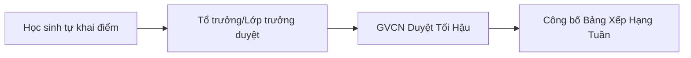

# 📖 CẨM NANG HƯỚNG DẪN SỬ DỤNG SỔ CHỦ NHIỆM SỐ (QLCN 12.7)
### Nền tảng Quản lý Toàn diện Lớp học Nội trú THPT Dành cho GVCN & Học Sinh
*Năm học 2026 – 2027 • Trường Phổ thông Dân tộc Nội trú (PTDTNT)*

---

## 📑 MỤC LỤC
1. [TỔNG QUAN & CÁCH CÀI ĐẶT APP (PWA)](#1-tổng-quan--cách-cài-đặt-app)
2. [HƯỚNG DẪN DÀNH CHO GIÁO VIÊN CHỦ NHIỆM (GVCN)](#2-hướng-dẫn-dành-cho-giáo-viên-chủ-nhiệm-gvcn)
   - 2.1. Đăng nhập & Bảo mật tài khoản GVCN
   - 2.2. Quản lý hồ sơ 32 học sinh & Tra cứu thông tin phụ huynh
   - 2.3. Quy trình điểm danh 5 buổi/ngày & Khóa sổ điểm danh
   - 2.4. Quy trình duyệt thi đua 3 cấp (Duyệt tối hậu & Xếp hạng tuần)
   - 2.5. Xếp sơ đồ chỗ ngồi thông minh (4 thuật toán tự động)
   - 2.6. Trợ lý Sư phạm AI (Google Gemini Flash)
   - 2.7. Sổ liên lạc điện tử & Xuất báo cáo gửi Phụ huynh
   - 2.8. Hòm thư tâm sự & Tư vấn tâm lý học sinh xa nhà
   - 2.9. Quản lý Quỹ lớp & Cấp phát / Đặt lại mã PIN cho học sinh
3. [HƯỚNG DẪN DÀNH CHO CÁN BỘ LỚP & TRƯỞNG PHÒNG KTX](#3-hướng-dẫn-dành-cho-cán-bộ-lớp--trưởng-phòng-ktx)
   - 3.1. Đăng nhập Cán bộ lớp
   - 3.2. Tổ trưởng duyệt nề nếp & thi đua tổ viên
   - 3.3. Trưởng phòng KTX điểm danh nề nếp 22h30 tắt đèn
4. [HƯỚNG DẪN DÀNH CHO HỌC SINH](#4-hướng-dẫn-dành-cho-học-sinh)
   - 4.1. Đăng nhập lần đầu & Đổi mã PIN cá nhân
   - 4.2. Tự nộp phiếu thi đua hàng tuần (Tự đánh giá)
   - 4.3. Điểm danh nhanh (Check-in) & Theo dõi điểm rèn luyện
   - 4.4. Trắc nghiệm hướng nghiệp RIASEC & Chính sách ưu đãi DTTS
   - 4.5. Gửi tâm sự ẩn danh cho Cô GVCN
   - 4.6. Nộp đơn xin phép vắng / Về thăm nhà cuối tuần
5. [CÂU HỎI THƯỜNG GẶP (FAQ) & HỖ TRỢ KỸ THUẬT](#5-câu-hỏi-thường-gặp-faq)

---

## 1. TỔNG QUAN & CÁCH CÀI ĐẶT APP

### 🌐 Địa chỉ truy cập
- **Website ứng dụng:** `https://qlcn-psi.vercel.app` (hoặc tên miền riêng do nhà trường cung cấp).
- **Thiết bị hỗ trợ:** Điện thoại thông minh (iPhone, Android), Máy tính bảng, Laptop và Máy tính để bàn.

### 📱 Cài đặt Ứng dụng lên Màn hình chính (PWA - Dùng như App điện thoại)
- **Trên iPhone / iPad (Safari):** 
  1. Mở trang web bằng trình duyệt **Safari**.
  2. Bấm vào biểu tượng **Chia sẻ (Share)** (hình ô vuông có mũi tên hướng lên ở thanh dưới).
  3. Chọn **"Thêm vào Màn hình chính" (Add to Home Screen)** $\rightarrow$ Bấm **Thêm (Add)**.
- **Trên Android (Chrome / Cốc Cốc):**
  1. Mở trang web bằng trình duyệt **Chrome**.
  2. Bấm vào dấu **3 chấm (⋮)** ở góc trên bên phải.
  3. Chọn **"Cài đặt ứng dụng"** hoặc **"Thêm vào Màn hình chính"**.
- *Biểu tượng Sổ Chủ Nhiệm Số sẽ xuất hiện ngoài màn hình chính, mở nhanh không cần gõ link web.*

---

## 2. HƯỚNG DẪN DÀNH CHO GIÁO VIÊN CHỦ NHIỆM (GVCN)

### 2.1. Đăng nhập & Bảo mật tài khoản GVCN
1. Tại cổng đăng nhập, chọn thẻ **"👩‍🏫 Cổng GVCN"**.
2. Nhập mật khẩu quản trị của Cô GVCN $\rightarrow$ Bấm **"Đăng Nhập Quản Trị"**.
3. **Đổi mật khẩu:** Để thay đổi mật khẩu định kỳ, bấm vào biểu tượng đại diện góc phải $\rightarrow$ Chọn **Đổi mật khẩu GVCN** $\rightarrow$ Nhập mật khẩu cũ và mật khẩu mới.

---

### 2.2. Quản lý hồ sơ 32 học sinh & Tra cứu thông tin phụ huynh
- Vào menu **"👥 Danh Sách Học Sinh"**:
  - Xem danh sách đầy đủ 32 học sinh với thông tin: Mã HS, Họ tên, Giới tính, Dân tộc, Phòng KTX, Tổ, Chức vụ.
  - **Bảo mật dữ liệu cá nhân (Nghị định 13/2023/NĐ-CP):** Số điện thoại phụ huynh và học sinh được bảo vệ, chỉ tài khoản GVCN mới có quyền xem đầy đủ số để liên hệ khẩn cấp.
  - Nhấp vào từng học sinh để xem hồ sơ chi tiết: Điểm thi thử, học lực lớp 11, hoàn cảnh gia đình (diện hộ nghèo, DTTS), ghi chú sư phạm riêng.

---

### 2.3. Quy trình điểm danh 5 buổi/ngày & Khóa sổ điểm danh
Mô hình trường PTDTNT yêu cầu theo dõi học sinh 24/7 qua **5 buổi trong ngày**:
1. ☀️ **Sáng (07:00):** Giờ lên lớp chính khóa.
2. 🌤️ **Chiều (13:30):** Buổi học chiều / Phụ đạo.
3. 📖 **Tự học tối (19:30 - 21:30):** Giờ học tập trung tại KTX / Phòng học.
4. 🛏️ **KTX Tắt đèn (22:30):** Trưởng phòng báo cáo quân số ngủ đúng phòng.
5. 🏃 **Tập thể / Ngoại khóa:** Sinh hoạt đầu tuần, lao động tập thể.

#### Thao tác của GVCN:
- Bấm vào biểu tượng trạng thái của học sinh:
  - 🟢 **Có mặt (P)**
  - 🟡 **Nghỉ có phép (P)** (ghi nhận kèm lý do)
  - 🔴 **Vắng không phép (A)** (tự động đánh dấu vào hệ thống thi đua)
  - 🟣 **Đi muộn (L)**
- **Khóa sổ điểm danh:** Cuối ngày hoặc sau mỗi buổi, GVCN bấm nút **"🔒 Khóa Sổ Điểm Danh"** để ngăn chặn chỉnh sửa trái phép từ tài khoản cán bộ lớp.

---

### 2.4. Quy trình duyệt thi đua 3 cấp (Thi đua 47 tiêu chí)
Hệ thống vận hành theo quy trình kiểm soát chặt chẽ 3 vòng:

1. **Vòng 1 (Học sinh):** Học sinh tự đối chiếu 47 tiêu chí nề nếp và nộp phiếu tự đánh giá.
2. **Vòng 2 (Cán sự lớp):** Tổ trưởng và Cờ đỏ đối chiếu với sổ theo dõi, xác nhận hoặc sửa đổi vi phạm.
3. **Vòng 3 (GVCN duyệt tối hậu):**
   - Vào menu **"📈 Thi Đua & Nề Nếp"**.
   - Xem danh sách tổng hợp điểm từng tổ và từng em.
   - GVCN có thể điều chỉnh cộng/trừ điểm đặc cách (khen thưởng đột xuất, giúp đỡ bạn bè, v.v.).
   - Bấm **"✅ Phê Duyệt Tối Hậu"** để chốt điểm và vinh danh Tổ Tiên tiến nhất tuần.

---

### 2.5. Xếp sơ đồ chỗ ngồi thông minh (Smart Seating Plan)
Vào menu **"📊 Tổng Quan"** $\rightarrow$ Khu vực **Sơ đồ lớp học**:
- Hệ thống hỗ trợ **4 thuật toán sắp xếp tự động**:
  1. 🤝 **Đôi bạn cùng tiến:** Tự động xếp học sinh có ĐTB cao ngồi kèm học sinh cần phụ đạo.
  2. 👫 **Đan xen Nam - Nữ:** Cân bằng giới tính giữa các bàn.
  3. 📑 **Phân bổ theo Tổ:** Dãy 1 (Tổ 1 & Tổ 2), Dãy 2 (Tổ 3 & Tổ 4) thuận tiện hoạt động nhóm.
  4. 🎲 **Ngẫu nhiên:** Xáo trộn vị trí công bằng định kỳ.
- **Đổi chỗ thủ công (Drag & Drop / Click to Swap):** Bấm vào học sinh thứ nhất $\rightarrow$ bấm vào chỗ thứ hai để tráo đổi tức thì.

---

### 2.6. Trợ lý Sư phạm AI (Google Gemini 2.5 Flash)
Vào menu **"🤖 Trợ Lý AI"**:
1. Chọn học sinh cần phân tích (trong danh sách 32 em).
2. Chọn mẫu nhiệm vụ AI:
   - 📋 **Báo cáo Họp Phụ Huynh Toàn Diện:** Tự động tổng hợp điểm chuyên cần 5 buổi, nề nếp KTX, kết quả học tập và định hướng ôn thi THPT.
   - 📱 **Tin nhắn Zalo/SMS Tuần Gửi Cha Mẹ:** Lời nhắn ngắn gọn, ấm áp, cập nhật điểm thi đua tuần và nhắc nhở thời gian tự học.
   - 🧭 **Tư vấn Định hướng Thi ĐH & Hệ DTTS:** Phân tích thế mạnh khối thi, gợi ý hệ Dự bị Đại học Dân tộc hoặc Cao đẳng nghề miễn học phí.
3. **Ghi chú thêm của GVCN (Tùy chọn):** Nhập yêu cầu riêng (ví dụ: *"nhắc em chú ý môn Tiếng Anh", "khen ngợi em vừa đạt giải văn nghệ"*).
4. Bấm **"✨ Bắt Đầu Tổng Hợp Báo Cáo AI"** $\rightarrow$ Sao chép kết quả gửi cho phụ huynh.

---

### 2.7. Sổ liên lạc điện tử & Xuất báo cáo gửi Phụ huynh
- Vào menu **"👨‍👩‍👧 Cổng Phụ Huynh"**:
  - Xem Sổ liên lạc điện tử của từng học sinh theo tuần.
  - Bấm **"🖨️ In / Xuất Phiếu Sổ Liên Lạc (PDF)"** để xuất phiếu kết quả tuần theo mẫu chuẩn sư phạm gửi phụ huynh ký tên.
  - Bấm **"📲 Gửi Zalo"** để mở nhanh ứng dụng Zalo gửi tin nhắn cập nhật cho bố mẹ.

---

### 2.8. Hòm thư tâm sự & Tư vấn tâm lý học sinh xa nhà
- Vào menu **"🤫 Hòm Thư Tâm Sự"**:
  - Tiếp nhận các tâm tư, khó khăn trong sinh hoạt nội trú hoặc áp lực học tập do học sinh gửi ẩn danh.
  - GVCN có thể trả lời trực tiếp lên hòm thư để giải tỏa thắc mắc và định hướng tâm lý kịp thời mà học sinh không bị lộ danh tính.

---

### 2.9. Quản lý Quỹ lớp & Cấp phát / Đặt lại mã PIN cho học sinh
- **Quỹ lớp:** Vào menu **"💰 Quỹ Lớp"** để theo dõi số dư realtime, thêm khoản thu (tiền quỹ định kỳ, tài trợ) và khoản chi (mua văn phòng phẩm, sinh nhật, thuốc men KTX).
- **Cấp lại PIN:** Khi học sinh quên mã PIN, GVCN mở file `student_pins_handover.csv` hoặc vào chi tiết học sinh để xem và đặt lại mã PIN mới.

---

## 3. HƯỚNG DẪN DÀNH CHO CÁN BỘ LỚP & TRƯỞNG PHÒNG KTX

### 3.1. Đăng nhập Cán bộ lớp
1. Chọn thẻ **"⭐ Cán Bộ Lớp"**.
2. Chọn tên của mình trong danh sách (Lớp trưởng, Lớp phó, 4 Tổ trưởng, 6 Trưởng phòng KTX).
3. Nhập **Mã PIN 6 số** do GVCN cấp $\rightarrow$ Bấm **"Đăng Nhập"**.

### 3.2. Nhiệm vụ của 4 Tổ Trưởng
- **Điểm danh đầu giờ:** Báo cáo nhanh các bạn vắng mặt trong tổ cho Lớp trưởng và GVCN.
- **Rà soát thi đua tuần của Tổ:**
  1. Vào menu **"📈 Thi Đua"** $\rightarrow$ Lọc xem các thành viên trong Tổ của mình.
  2. Kiểm tra các lỗi vi phạm tổ viên tự khai xem đã trung thực chưa.
  3. Xác nhận và chuyển phiếu lên để GVCN phê duyệt cuối tuần.

### 3.3. Nhiệm vụ của Trưởng phòng KTX (Phòng A1-07 đến C08)
- Đúng **22:30 hàng đêm**:
  1. Kiểm tra quân số các bạn trong phòng KTX của mình.
  2. Bật App $\rightarrow$ Vào **"📝 Điểm Danh"** $\rightarrow$ Thẻ **"KTX Đi Ngủ (22h30)"**.
  3. Bấm xác nhận các bạn đã có mặt trên giường ngủ đúng giờ tắt đèn. Báo ngay cho Cô GVCN nếu có bạn vắng mặt bất thường.

---

## 4. HƯỚNG DẪN DÀNH CHO HỌC SINH

### 4.1. Đăng nhập lần đầu & Đổi mã PIN cá nhân
1. Tại màn hình chính, chọn thẻ **"🎓 Học Sinh"**.
2. Tìm và chọn đúng **STT và Họ tên** của mình trong danh sách lớp.
3. Nhập **Mã PIN cá nhân** được Cô GVCN phát $\rightarrow$ Bấm **"Đăng Nhập"**.
4. **Đổi mã PIN:** Để người khác không truy cập vào tài khoản của mình, em hãy vào mục **"Cài đặt tài khoản"** $\rightarrow$ Nhập mã PIN mới (gồm 4 - 6 chữ số dễ nhớ nhưng bảo mật).

---

### 4.2. Tự nộp phiếu thi đua hàng tuần (Tự đánh giá)
- Vào tối Thứ 6 hàng tuần:
  1. Mở menu **"📈 Tự Đánh Giá Thi Đua"**.
  2. Đọc kỹ các tiêu chí (Đồng phục, chuyên cần, trực nhật, tự học KTX...).
  3. Tích chọn trung thực các nội dung vi phạm nếu có.
  4. Bấm **"📤 Gửi Phiếu Cho Tổ Trưởng & GVCN"**.

---

### 4.3. Điểm danh nhanh (Check-in) & Xem kết quả cá nhân
- Vào đầu mỗi buổi học hoặc giờ tự học tối:
  - Mở App và bấm nút **"✅ Tôi Đã Có Mặt"** để tự động điểm danh chuyên cần.
  - Xem lịch sử điểm danh và điểm thi đua tích lũy của mình trong tháng.

---

### 4.4. Trắc nghiệm hướng nghiệp RIASEC & Chính sách ưu đãi DTTS
- Vào menu **"🧭 Hướng Nghiệp 12"**:
  - Làm bài trắc nghiệm tính cách nghề nghiệp **Holland (6 nhóm: Kỹ thuật, Nghiên cứu, Nghệ thuật, Xã hội, Quản lý, Nghiệp vụ)** để biết bản thân phù hợp ngành nghề nào.
  - **Tra cứu chính sách đặc thù học sinh DTTS:**
    - Hệ **Sư phạm / Y khoa:** Hỗ trợ tiền đóng học phí và sinh hoạt phí (Nghị định 116).
    - Hệ **Dự bị Đại học Dân tộc (Sầm Sơn, Nha Trang, TP.HCM):** Cơ hội học 1 năm chuyển tiếp thẳng vào các trường Đại học trọng điểm.
    - Hệ **Cao đẳng nghề:** Miễn 100% học phí (Nghị định 81).

---

### 4.5. Gửi tâm sự ẩn danh cho Cô GVCN
- Nếu em gặp chuyện buồn, áp lực ôn thi THPT, xích mích bạn bè ở phòng KTX mà ngại nói trực tiếp:
  1. Vào menu **"🤫 Hòm Thư Tâm Sự"**.
  2. Viết nội dung muốn chia sẻ (Hệ thống **hoàn toàn ẩn danh**, không ai biết ai gửi).
  3. Bấm **"Gửi Thư"**. Cô GVCN sẽ đọc và trả lời, hỗ trợ em kịp thời.

---

### 4.6. Nộp đơn xin phép vắng / Về thăm nhà cuối tuần
- Vào menu **"📝 Đơn Nghỉ Phép / Về Nhà"**:
  - Điền lý do xin về (Ốm đau, việc gia đình, về nhà cuối tuần).
  - Ghi rõ ngày giờ đi và ngày giờ có mặt lại KTX.
  - Bấm **"Gửi Đơn"** để Cô GVCN xét duyệt online.

---

## 5. CÂU HỎI THƯỜNG GẶP (FAQ) & XỬ LÝ SỰ CỐ

| Vấn đề gặp phải | Nguyên nhân | Cách xử lý nhanh |
| :--- | :--- | :--- |
| **Quên mã PIN đăng nhập** | Học sinh đổi PIN nhưng quên | Báo ngay cho Cô GVCN để Cô mở danh sách và đặt lại PIN mới về mặc định. |
| **Báo lỗi "Mật khẩu không đúng"** | Nhập nhầm ký tự hoặc viết hoa | Kiểm tra xem phím CapsLock có đang bật không. Thử nhập lại cẩn thận. |
| **Mất kết nối mạng / Mạng chập chờn** | Sóng Wifi KTX yếu | Ứng dụng có chế độ bộ nhớ đệm (Cache PWA), dữ liệu điểm danh offline sẽ tự động đồng bộ khi có mạng lại. |
| **Không bấm được nút lưu điểm danh** | GVCN đã bấm Khóa sổ | Chỉ tài khoản Cô GVCN mới có quyền mở khóa sổ điểm danh để chỉnh sửa. |

---

> 💡 **LỜI NHẮC DÀNH CHO TẬP THỂ LỚP 12.7:**  
> *Sổ Chủ Nhiệm Số là ngôi nhà chung giúp lớp mình kỷ cương hơn, gắn kết hơn và cùng nhau đạt kết quả cao nhất trong Kỳ thi Tốt nghiệp THPT Quốc gia 2027!*
